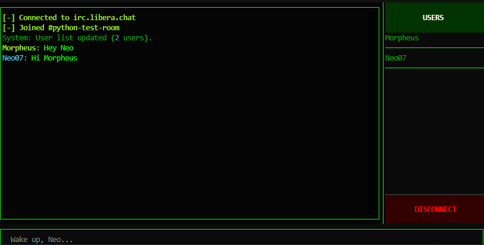

# Hermes IRC Client


**Hermes** is a modern, terminal-based IRC client built with Python and [Textual](https://textual.textualize.io/). It combines the nostalgia of classic IRC with a sleek, Matrix-inspired "Cyberpunk" aesthetic and modern features like autocomplete and a responsive UI.

## ✨ Features

* **Cyberpunk Aesthetic:** A "Matrix" inspired theme with neon green text on a black background, complete with ASCII art banners.
* **Modern TUI:** Built on `Textual`, offering a responsive layout, clickable elements, and smooth scrolling.
* **Smart Autocomplete:** Nickname autocompletion that updates dynamically as users join or leave the channel.
* **Visual Sidebar:** A dedicated sidebar displaying the current user list and a quick disconnect button.
* **Threaded Networking:** A robust, non-blocking network layer that handles IRC protocol messages (PING/PONG, PRIVMSG, etc.) in the background without freezing the UI.
* **Dynamic Status:** Visual feedback for connection states (Yellow for connecting, Green for connected, Red for errors).

## 🚀 Installation

1. **Clone the repository:**
```bash
git clone https://github.com/yourusername/hermes-irc.git
cd hermes-irc

```


2. **Install dependencies:**
Hermes relies on `textual` for the interface and `pyfiglet` for the banner generation.
```bash
pip install textual pyfiglet

```


3. **Run the client:**
```bash
python app.py

```


## 🎮 Usage

1. **Login:**
* Launch the app.
* Enter the **Server Address** (defaults to `irc.libera.chat`).
* Enter the **Channel** (defaults to `##python-test-room`).
* Enter your **Nickname**.
* Press "ENTER THE MATRIX".


2. **Chatting:**
* Type messages in the input bar at the bottom.
* Use the **Right Arrow** key to accept nickname suggestions (ghost text).
* Type `/quit` or click the **DISCONNECT** button in the sidebar to exit.


## 📂 Project Structure

* `ui.py`: The main entry point. Contains the Textual application logic, Screen definitions (`LoginScreen`, `ChatScreen`), and UI event handlers.
* `backend.py`: The networking core. Handles the raw TCP socket connection, parses incoming IRC protocol messages, and dispatches events to the UI via callbacks.
* `banner.py`: (Optional helper) Generates the gradient ASCII art banner using `pyfiglet` and `rich`.
* `style.py` / CSS Strings: Contains the `MATRIX_CSS` definitions for styling the TUI.

## 🛠️ Architecture

Hermes uses a **Producer-Consumer** pattern with thread-safe UI updates:

1. **Backend Thread:** The `IRCClient` class runs a continuous loop on a background thread, listening for raw bytes from the server. It parses these into actionable events (e.g., "Message received", "User list updated").
2. **UI Thread:** The `Textual` app runs on the main thread.
3. **The Bridge:** When the backend receives data, it calls a callback function. The UI wrapper (`dispatch_ui`) uses `self.app.call_from_thread()` to safely schedule UI updates (like printing to the log or updating the sidebar) on the main thread, preventing race conditions.

## 🤝 Contributing

Contributions are welcome! If you'd like to add features like **Private Messaging tabs**, **SASL Authentication**, or **Theme Switching**, feel free to fork the repo and submit a pull request.
